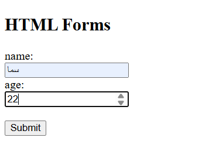
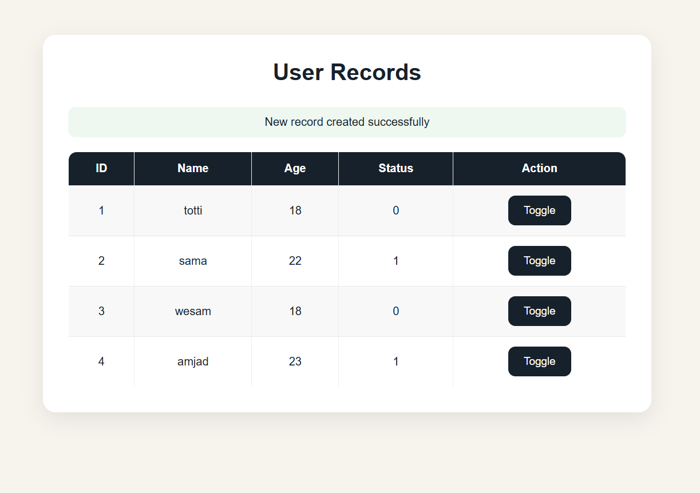
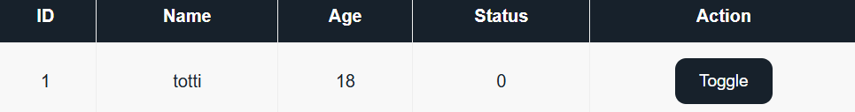
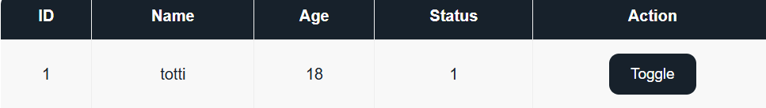

# User Status Management System

A simple web application built using HTML, CSS, JavaScript, PHP, and MySQL. The system allows users to add records, display stored data, and toggle user status between `0` and `1` instantly without refreshing the page.

---

## Features

- Add a new user by entering a name and age.
- Store user information in a MySQL database.
- Display all saved records in a table.
- Toggle user status between `0` and `1`.
- Update the status instantly without refreshing the page.
- Simple and clean user interface.

---

## Technologies Used

- HTML5
- CSS3
- JavaScript
- PHP
- MySQL
- phpMyAdmin
- InfinityFree

---

## Project Structure

```text
User-Status-Management-System
│
├── images
│   ├── User_Form.png
│   ├── User_Records.png
│   ├── Toggle_Before.png
│   └── Toggle_After.png
│
├── from.html
├── n.php
├── toggle.php
├── style.css
└── README.md
```

---

## Preview

### User Form

<p align="center">
  
</p>

---

### User Records

<p align="center">
  
</p>

---

### Toggle Status (Before)

<p align="center">
  
</p>

---

### Toggle Status (After)

<p align="center">
  
</p>

---

## How It Works

1. Enter the user's name and age.
2. Click the **Submit** button.
3. The entered information is stored in the MySQL database.
4. All saved records are displayed in a table.
5. Click the **Toggle** button to change the user's status.
6. The status is updated instantly without refreshing the page.

---

## Database

The project uses a MySQL database with a table named **users**.

| Column | Type | Description |
|---------|------|-------------|
| ID | INT | Primary Key (Auto Increment) |
| Name | VARCHAR | User name |
| Age | INT | User age |
| Status | TINYINT | User status (0 = Inactive, 1 = Active) |

---

## Author

👩🏻‍💻 Developed by **Sama Alzahrani**
